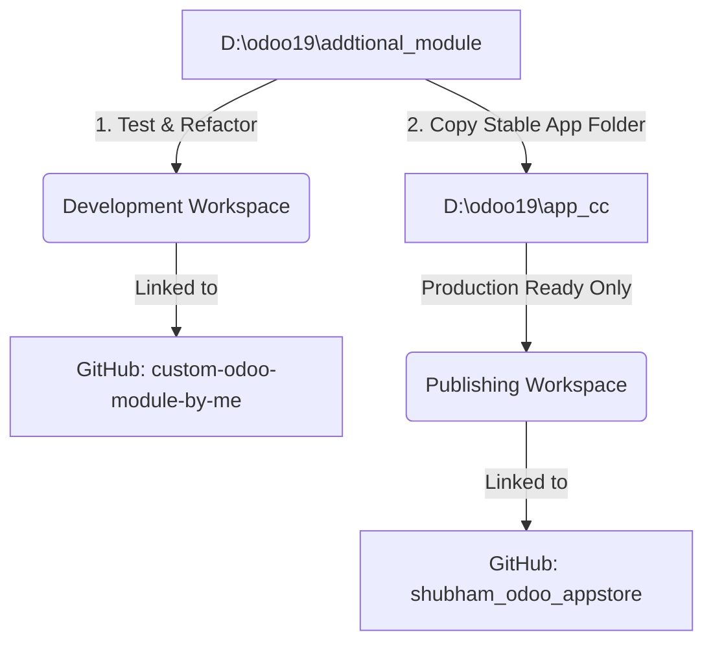

# Odoo App Store Publishing Guide & Registry

This document serves as the official operational guide and registry for publishing custom Odoo modules to the Odoo Apps Store from your decoupled workspaces. 

> [!IMPORTANT]
> **Design Theme Policy**: All marketing description files (`index.html`) and app logos/icons (`icon.png`) **MUST always use a clean, professional White/Light Theme** (light-mode backgrounds, dark-contrast typography, and light/white backgrounds for app icons). Dark or neon-only themes are not permitted for store listing presentations.

---

## 1. Workspace & Repository Isolation

To prevent development files, test scripts, local configurations, and git history from mixing with production-ready App Store releases, we use two separate directories:



### Development Workspace
* **Path**: `D:\odoo19\addtional_module`
* **GitHub Repository**: `https://github.com/Shubham-records/custom-odoo-module-by-me.git`
* **Purpose**: Active development, testing, local configuration files (e.g. `.conf` files), and experiment scripts. Branches should target version branches (e.g., `19.0`).

### Publishing Workspace
* **Path**: `D:\odoo19\app_cc`
* **GitHub Repository**: `https://github.com/Shubham-records/shubham_odoo_appstore.git`
* **Purpose**: The "Clean Source of Truth" for release. Only contains stable Odoo module folders ready to be crawled by the Odoo App Store crawler. **Never include configuration files, IDE settings, or raw dev scripts here.**

---

## 2. Release & Sync Workflow

Follow this step-by-step workflow to release or update any module:

1. **Verify Manifest & Quality in Development (`addtional_module`)**:
   Ensure the module's `__manifest__.py` has:
   * `'author': 'shubham kumar pal'`
   * `'website': 'https://github.com/Shubham-records'`
   * `'license': 'OPL-1'` (or the chosen commercial license)
   * `'price': <Price>`
   * `'currency': 'EUR'`
   * `'images': ['static/description/banner.png']`
   * Confirm the logo (`static/description/icon.png`) and description (`static/description/index.html`) use a **white theme**.
2. **Copy Stable Code**:
   Copy the stable module folder (e.g. `api_request_tester`) from `D:\odoo19\addtional_module` into `D:\odoo19\app_cc`.
3. **Commit & Push to Appstore Repo (`shubham_odoo_appstore`)**:
   Run the following commands inside `D:\odoo19\app_cc`:
   ```bash
   git add -A
   git commit -m "release: add/update <module_name> version <version>"
   git push origin 19.0
   ```
4. **Trigger Odoo App Store Sync**:
   * Navigate to your Odoo developer dashboard.
   * Ensure your repository is registered with the correct version branch suffix: `https://github.com/Shubham-records/shubham_odoo_appstore.git#19.0`
   * Confirm that the GitHub collaborator **`online-odoo`** has been invited to your private repo with **Read** permissions.
   * Click **Scan** to index the new release.
5. **Update This Registry (MANDATORY)**:
   * After each successful push or scan, **you must update the Published Modules Registry table below** in this file, commit the change, and push it to your development repository `custom-odoo-module-by-me`.

---

## 3. Published Modules Registry

Use the table below to track all modules published on the Odoo Apps Store under your account.

| Module Directory | App Store Display Name | Version | Price (EUR) | Status | Last Scanned Date |
| :--- | :--- | :---: | :---: | :---: | :---: |
| `api_request_tester` | API Request Tester | `19.0.2.0.0` | €99.00 | **Published** | 2026-06-08 |

---

> [!TIP]
> Keep this registry updated to easily track your commercial portfolio and maintain clean division between your code repositories.
